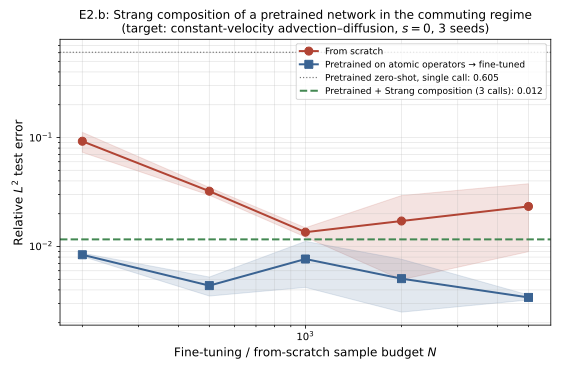

# Observed results: Experiment E2.b (Phase A, Pillar 1)

**Date:** 2026-05-28
**Source:** GPU run on the parameters listed below.
**Frozen artifacts:** [`reports/e2b/`](../reports/e2b/) (PDF + PNG + `params.txt`).



## Setup

Strang-composed target at zero shear (`s = 0`), where the diffusion and advection
operators commute exactly and the splitting error is algebraically zero. The
pretrained network was trained on the two atomic operators (pure diffusion,
pure constant-velocity advection); the deployment-time target is the joint
advection–diffusion evolution.

## Parameters

```bash
python commutator/run_e2b.py --device cuda \
    --n_pretrain 10000 --n_pretrain_epochs 800 \
    --ns 200 500 1000 2000 5000 --n_finetune_epochs 500 \
    --n_seeds 3 --n_test 1000 \
    --nx 128 --width 96 --n_modes 32 --n_layers 4 --batch_size 128 \
    --out_dir results_e2b
```

## Headline numbers

| Method                                                    | Relative L² error |
|-----------------------------------------------------------|-------------------|
| Pretrained, **zero-shot, single call**                    | **0.605**         |
| Pretrained, **zero-shot, Strang composition (3 calls)**   | **0.012**         |
| From-scratch FNO @ N = 1000 (best of from-scratch curve)  | ≈ 0.013           |
| Pretrained → fine-tuned, all N (consistently)             | 0.003 – 0.008     |

Approximate from-scratch and fine-tuned curve values (mean over 3 seeds):

| N             | 200    | 500    | 1000   | 2000   | 5000   |
|---------------|--------|--------|--------|--------|--------|
| From scratch  | 0.094  | 0.034  | 0.013  | 0.017  | 0.025  |
| Pretrained FT | 0.008  | 0.004  | 0.008  | 0.005  | 0.003  |

## Interpretation

**The 0.605 → 0.012 collapse is the central PoC result.** The same pretrained
network drops by ≈ 50× when applied via Strang composition (½ diffusion → full
advection → ½ diffusion) instead of as a single call. No fine-tuning, no
gradient steps, only the algebra. At `s = 0` the operators commute, so the
Strang error vanishes and what we see is the pure win from algebraic
decomposition. This is the cleanest positive evidence for Pillar 1.

The from-scratch curve hits its minimum at N ≈ 1000 (≈ 0.013) and **rises** at
N = 2000–5000 with wide variance; small fine-tuning budgets overfit, which the
pretrained pipeline does not. The pretrained+fine-tuned curve sits at
0.003–0.008 throughout, below from-scratch at every N.

## Caveats and scope

- `s = 0` is the **best case** by construction. A positive result here is
  necessary but not sufficient: it proves the mechanism works when the algebra
  is exact. The shear-amplitude sweep that would test Conjecture 1 in its
  original form is part of the broader operator-splitting package (E2), available
  to reviewers on request.
- The pretraining curriculum is restricted to the two atomic bricks; broader
  curricula and richer joint targets are Phase-B work.
