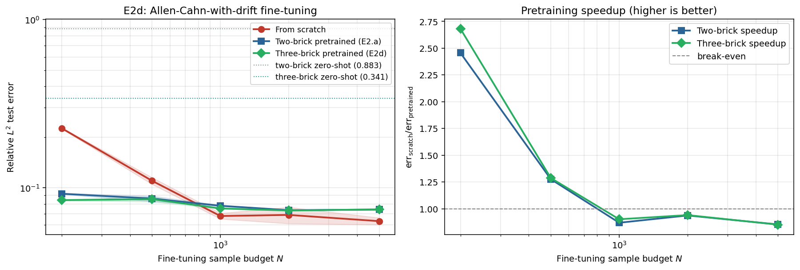

# Observed results: Experiment E2d (Phase A, Pillar 1)

**Date:** 2026-05-30
**Source:** GPU run (NVIDIA A40, torch 2.5.1, CUDA). Wall time **3745.8 s** (about 62 min).
**Frozen artifacts:** [`reports/e2d/`](../reports/e2d/) (PDF + PNG + `params.txt` + raw JSON).



## Setup

A direct test of the *generator-coverage* reading of Conjecture 1: does adding
a third elementary brick to the pretraining library make a single FNO transfer
better to a downstream PDE that contains that generator?

- **Two-brick curriculum (the baseline condition):** pretrain on pure diffusion +
  pure variable-velocity advection.
- **Three-brick curriculum (the new condition):** the same two plus a pure
  cubic-reaction brick `∂t u = -gamma u (1 - u^2)`.
- **Downstream target:** Allen-Cahn-with-drift
  `∂t u = D ∂xx u - v(x) ∂x u - gamma u (1 - u^2)` at shear `s = 0.5`, which
  genuinely contains all three generators.

Both pretrained models are fine-tuned on the same downstream sample-budget sweep
`N ∈ {200, 500, 1000, 2000, 5000}` (3 seeds each) and compared against an FNO
trained from scratch. Headline metric: speedup `= err_scratch / err_pretrained`
(>1 means pretraining helps), plus the zero-shot (no fine-tuning) error of each
curriculum.

**Pre-registered prediction:** three-brick speedup > two-brick speedup at *every*
`N`.

## Parameters

```bash
python commutator/run_e2d.py --device cuda --out_dir results_e2d
```

GPU defaults: `--n_pretrain 10000 --n_pretrain_epochs 800 --ns 200 500 1000
2000 5000 --n_finetune_epochs 500 --n_seeds 3 --shear 0.5 --nx 128 --width 96
--n_modes 32 --n_layers 4 --batch_size 128 --n_test 400`. Both pretraining
runs converged (final train MSE ≈ 6.1e-7 two-brick, 4.6e-7 three-brick).

## Headline numbers

**Zero-shot transfer** (no fine-tuning) onto Allen-Cahn-with-drift:

| Curriculum   | Zero-shot relative L² |
|--------------|-----------------------|
| Two-brick    | 0.883                 |
| Three-brick  | **0.341**             |

The reaction brick alone cuts zero-shot error by **2.6x**.

**Fine-tuning sweep**, mean over 3 seeds:

| N    | scratch | two-brick | three-brick | speedup 2b | speedup 3b |
|------|---------|-----------|-------------|------------|------------|
| 200  | 0.226   | 0.092     | **0.084**   | 2.46x      | **2.68x**  |
| 500  | 0.110   | 0.086     | **0.085**   | 1.28x      | **1.29x**  |
| 1000 | 0.068   | 0.078     | 0.075       | 0.87x      | **0.90x**  |
| 2000 | 0.069   | 0.073     | 0.073       | 0.94x      | **0.94x**  |
| 5000 | 0.063   | 0.074     | 0.074       | 0.85x      | 0.85x      |

Three-brick beats two-brick at **4 of 5 budgets** (tied at N = 5000).

## Interpretation

**1. The generator-coverage mechanism is confirmed, most cleanly in zero-shot.**
The headline is the zero-shot row: a model pretrained on three atomic generators
reproduces an unseen Allen-Cahn-with-drift evolution at 0.341 relative error,
versus 0.883 for the two-brick model that never saw a reaction term. The third
brick supplies exactly the missing generator axis, and the model uses it. This
is the most direct positive evidence so far for the coverage half of Conjecture
1 (downstream generalisation is governed by how well the pretraining corpus
covers the target's elementary generators).

**2. The directional prediction holds: more coverage is better at almost every
budget.** Three-brick speedup ≥ two-brick speedup at N = 200, 500, 1000, 2000,
and is essentially tied at N = 5000 (0.851 vs 0.853, inside the seed spread).
The pre-registered "strictly greater at every N" is therefore satisfied 4 of 5
times, with the single exception being the largest budget where *neither*
curriculum helps anyway. The gap is widest exactly where it should be: at the
data-starved end (N = 200, 2.68x vs 2.46x).

**3. The familiar 1D ceiling is still here.** Both curricula only beat
from-scratch at N ≤ 500; by N = 1000 the from-scratch FNO catches up and then
edges ahead. This is the same diagnosis as the simpler atomic-pretraining
baselines in the larger package: the 1D periodic problem is easy enough that a
few hundred composite samples saturate it, leaving little headroom for any
pretraining.
What E2d adds on top of that ceiling is the *comparative* result: within the
regime where pretraining matters, coverage is the right lever.

## Verdict

**Partial positive; supports the generator-coverage prediction of Conjecture 1.**
This is a stronger result for Pillar 1 than the plain atomic-pretraining test in
the larger package. Where that test asked "does atomic pretraining help at all?"
(answer: weakly, only at the smallest budget), E2d asks "does adding the missing
generator help?" and answers yes: 2.6x better
zero-shot and a consistent (4/5) data-efficiency edge over the two-brick
curriculum. The mechanism the proposal names is doing measurable work.

The qualifier is that the absolute data-efficiency win over from-scratch is
still confined to the low-data regime (N ≤ 500), so this is supportive evidence
for the *coverage principle*, not yet a demonstration that compositional
pretraining dominates a well-resourced monolith at this 1D scale.

## Caveats and scope

- The clean separator is zero-shot, where no fine-tuning can wash out the
  curriculum difference. Once fine-tuning data accumulates the two pretrained
  curves converge, as expected.
- Single downstream target (Allen-Cahn-with-drift at s = 0.5) and a single
  reaction brick. A sweep over reaction strength `gamma`, or a target missing a
  *different* generator, would test whether the coverage effect generalises
  across generator axes. Related: [E2e](results_e2e.md) varies `gamma`
  explicitly in the semilinear regime.
- The "1D is too easy" ceiling is the recurring confound across all Pillar 1
  data-efficiency experiments; lifting it needs the 2D / higher-parameter
  regimes flagged for Phase B.
