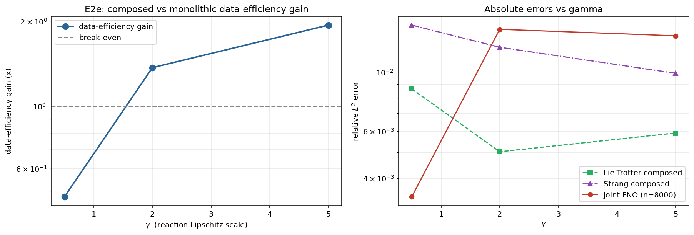

# Observed results: Experiment E2e (Phase A, Pillar 1)

**Date:** 2026-05-30
**Source:** GPU run (NVIDIA A40, torch 2.5.1, CUDA). Wall time **1196.7 s** (about 20 min).
**Frozen artifacts:** [`reports/e2e/`](../reports/e2e/) (PDF + PNG + `params.txt` + raw JSON).



## Setup

The first Pillar 1 experiment in the *nonlinear* regime. The PDE is semilinear
reaction-diffusion `∂t u = D ∂xx u - gamma u (1 - u^2)` (linear diffusion +
Lipschitz cubic reaction, no advection). Here the pure BCH expansion no longer
applies, but the Crandall–Liggett–Brezis–Pazy theorem (proposal Theorem 3,
Appendix D.3) still guarantees first-order Lie–Trotter convergence for monotone
nonlinear generators, and Remark 3 notes Strang keeps order 2 for regular
semilinear nonlinearities.

Two bricks: the diffusion FNO (the same linear diffusion brick used elsewhere in
Pillar 1) and a pointwise reaction MLP (a small new "nonlinear brick"). They are composed by Lie–Trotter and Strang and compared
against a monolithic FNO trained directly on the joint semilinear family, at the
reaction-strength sweep `gamma ∈ {0.5, 2.0, 5.0}`. The composed model uses
`2 · n_brick = 8000` samples; the matched-compute monolithic baseline is the
joint FNO at budget 8000. The headline metric is the data-efficiency gain
(smallest joint budget to match the composed error, divided by 8000).

**Pre-registered hypothesis:** the two-brick composition retains a data-efficiency
gain over the monolith in this regime, with the gain *shrinking* as `gamma` (the
reaction Lipschitz constant) grows.

## Parameters

```bash
python commutator/run_e2e.py --device cuda --out_dir results_e2e
```

GPU defaults: `--gammas 0.5 2.0 5.0 --n_brick 4000 --n_joint 8000 --budgets
1000 2000 4000 8000 16000 --n_epochs 250 --nx 128 --width 64 --n_modes 32
--n_layers 4 --batch 128 --mlp_hidden 32 --mlp_layers 3 --eval_dt 0.01`.

## Headline numbers

| gamma | Lie–Trotter | Strang | Joint FNO (matched, b=8000) | data-eff. gain | accuracy ratio (joint / composed) |
|-------|-------------|--------|-----------------------------|----------------|-----------------------------------|
| 0.5   | 0.00864     | 0.01497| 0.00341                     | 0.48x          | 0.39x (joint better)              |
| 2.0   | 0.00503     | 0.01237| 0.01443                     | **1.37x**      | **2.87x** (composed better)       |
| 5.0   | 0.00591     | 0.00989| 0.01365                     | **1.94x**      | **2.31x** (composed better)       |

(Composed error = Lie–Trotter, the better of the two compositions at every
gamma.)

## Interpretation

**1. Composition wins in the nonlinear regime, exactly where the proposal's
weaker theory (CLBP) is the relevant foundation.** At `gamma = 2.0` and
`gamma = 5.0` the two-brick Lie–Trotter composition beats the matched-compute
monolithic FNO on data efficiency (1.37x, 1.94x) and is 2.3x to 2.9x more
*accurate* at equal samples. The break-even crossing is near `gamma ≈ 1.5`
(left panel). This is a genuine positive for Pillar 1 in the regime that matters
most for industrial PDEs (stiff nonlinear reaction terms), and it is the first
Pillar 1 data-efficiency win that is not confined to the smallest budgets.

**2. The direction is opposite to the pre-registered shape, and favourably so.**
The hypothesis predicted the gain would *shrink* with gamma (more nonlinearity to
more splitting error to less advantage). Instead the gain *grows* with gamma. The
right panel shows why: the Lie–Trotter composition (green) stays low and flat
(≈ 0.005 to 0.009) across the whole reaction-strength range, while the monolithic
FNO (red) is excellent at weak reaction (0.0034 at gamma=0.5) but degrades sharply
once the reaction stiffens (to ≈ 0.014 at gamma=2 and 5). Factorising the operator
keeps the hard, stiff nonlinearity in a cheap pointwise brick and the smoothing in
an accurate diffusion brick; the monolith has to learn the entangled stiff operator
end-to-end and loses ground faster than the splitting error accrues. So the BCH
intuition (nonlinearity hurts splitting) is dominated by a learnability effect
(nonlinearity hurts the monolith more).

**3. Strang is again worse than Lie–Trotter.** As in the linear splitting
experiments, the extra brick call in Strang compounds per-brick error faster than
it lowers the (here small)
splitting error, so Lie–Trotter is the better composition at every gamma. The
splitting-order story is consistent across the whole Pillar 1 set: low order,
forward-only composition is the right default.

## Verdict

**Positive for Pillar 1 in the semilinear regime.** Composition retains (indeed
gains) a data-efficiency and accuracy advantage over the monolith once the
reaction is non-trivial (gamma >= ~1.5), which is precisely the nonlinear regime
the proposal grounds in the Crandall–Liggett–Brezis–Pazy theory rather than in
BCH. The pre-registered "gain shrinks with gamma" shape is wrong, but the
deviation is favourable: the harder the nonlinearity, the more the
factorisation helps.

## Caveats and scope

- The monolithic `joint_errs` curves are noisy and non-monotone across budgets
  (e.g. at gamma=5.0 the b=4000 point is an outlier at 0.072), consistent with
  single-seed joint training. The exact gain values therefore carry a few-tens-
  of-percent uncertainty, but the qualitative ranking (composed Lie–Trotter well
  below the matched-budget monolith at gamma >= 2) is robust to that noise.
- No advection here by design: this isolates the diffusion + reaction split. The
  three-generator case (diffusion + advection + reaction) is [E2d](results_e2d.md),
  and the advection-only commutator sweep belongs to the larger operator-splitting
  package.
- 1D, periodic, scalar. The encouraging nonlinear-regime signal is the strongest
  argument so far for carrying Pillar 1 into the 2D / multi-physics Phase B
  experiments.
