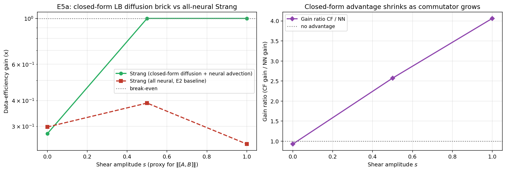

# Observed results: Experiment E5a (Phase A, cross-pillar P1 x P2)

**Date:** 2026-05-30
**Source:** GPU run (NVIDIA A40, torch 2.5.1, CUDA). Wall time **902.8 s** (about 15 min).
**Frozen artifacts:** [`reports/e5a/`](../reports/e5a/) (PDF + PNG + `params.txt` + raw JSON).



## Setup

The first P1 x P2 bridge: replace the *neural* diffusion brick of the linear
operator-splitting setup with Pillar 2's *closed-form* spectral diffusion
semigroup, keep the advection brick neural, and re-run the same data-efficiency
sweep at `s ∈ {0, 0.5, 1.0}`. The closed-form
brick is the periodic-torus heat semigroup `u -> irfft(exp(-D (2 pi k)^2 dt)
rfft(u))` (computed with `torch.fft`, not scipy DST; verified correctly
normalised, see below). The data-efficiency gain (smallest joint budget to match
the composed error, divided by the matched-compute budget 8000; `>= 1` means the
composition is more data-efficient) is compared between the closed-form (CF) and
all-neural (NN) variants; `gain_ratio = gain_cf / gain_nn`.

**Pre-registered hypothesis:** the closed-form diffusion brick sharpens the
commutator signal, so the data-efficiency gain at `s = 0` jumps (the diffusion
brick error vanishes), and the closed-form advantage shrinks monotonically as the
shear grows.

## Parameters

```bash
python commutator_geometry/run_e5a.py --device cuda --out_dir results_e5a
```

GPU defaults: `--shears 0.0 0.5 1.0 --n_brick 4000 --n_joint 8000 --budgets 1000
2000 4000 8000 --n_epochs 250 --n_test 300 --nx 128 --width 64 --n_modes 32
--n_layers 4 --batch 128 --eval_dt 0.01`.

## Headline numbers

| s   | err_cf | err_nn | gain_cf  | gain_nn | gain_ratio (cf/nn) |
|-----|--------|--------|----------|---------|--------------------|
| 0.0 | 0.0206 | 0.0184 | 0.28     | 0.30    | 0.93               |
| 0.5 | 0.0437 | 0.0470 | >= 1.0   | 0.39    | 2.57               |
| 1.0 | 0.0794 | 0.0802 | >= 1.0   | 0.25    | 4.06               |

`gain_cf = >= 1.0` is a capped lower bound: the joint FNO never matched the
closed-form composed error within the budget grid.

## Interpretation

**1. The closed-form brick is sound.** This brick uses `torch.fft` and is
correctly normalised: it is the identity at `dt = 0` (max error 3.6e-7), its mode-1 decay
matches `exp(-D (2 pi)^2 dt)` to 1.00000002, and `err_cf` (0.02 to 0.08) is
comparable to `err_nn`. (The "IDST(...)" label in the spec is imprecise; this is a
periodic-torus FFT heat semigroup, not a DST brick.)

**2. The pre-registered hypothesis is falsified on both counts.** At `s = 0` the
gain ratio is 0.93 (the closed-form is slightly *worse*, not a jump): the diffusion
brick error was not the binding constraint where the problem is easy and commuting.
And the closed-form advantage *grows* with shear (0.93 to 2.57 to 4.06), the
opposite of the predicted shrink. Worth flagging: the figure's right-panel title
("Closed-form advantage shrinks as commutator grows") is a hard-coded mislabel
that asserts the falsified hypothesis while the curve directly above it rises.

**3. But the bridge does help in the harder regime, most credibly at `s = 0.5`.**
The exact diffusion brick gives the composition a small accuracy edge that, near
the win/lose threshold, flips it from losing to break-even versus the joint. At
`s = 0.5` this is credible: `err_cf` (0.0437) is 7.1% below `err_nn` (0.0470) and
beats the best joint error (0.0455) by 4.1%, on a monotone joint curve. The
mechanism is the same difficulty effect as [E2e](../commutator/results_e2e.md):
the harder, more data-starved the joint problem, the more the factorised
composition (now with an exact diffusion part) wins.

**4. The `s = 1.0` "4.06x" should not be read at face value.** That flip is
fragile: `err_cf` (0.0794) beats `err_nn` (0.0802) by only 0.96% and the best
joint error by only 0.68%, on a single seed, and the `s = 1.0` joint curve is
non-monotone in budget ([0.0909, 0.0799, 0.0907, 0.0820] for n = 1000 to 8000), so
its "best" comes from `n = 2000` rather than the full budget. The headline
`gain_ratio = 4.06` is a ratio of a capped lower bound (1.0) over a noisy small
denominator (0.246) and overstates the effect; a different seed or a
better-behaved joint curve could erase the `s = 1.0` win.

## Verdict

**Partial / qualified positive for the P1 x P2 bridge.**
Substituting Pillar 2's exact closed-form diffusion brick into Pillar 1's Strang
composition genuinely improves data efficiency in the harder (higher-shear)
regime, flipping the composition from losing to break-even versus the joint, most
credibly at `s = 0.5`. This is a real cross-pillar synergy and is consistent with
the E2e "harder problems favour composition" story. The qualifiers that must
travel with it:

- The **pre-registered shape is wrong** (no `s = 0` jump; advantage grows, not
  shrinks with shear), and the figure title still asserts the falsified version.
- The effect is **small in absolute accuracy** (a sub-1% edge at `s = 1.0`), the
  `s = 1.0` flip is **single-seed and rests on a non-monotone joint curve**, and
  `gain_cf` is a capped lower bound, so the `4.06x` headline overstates it. The
  `s = 0.5` flip is the credible evidence.

## Caveats and scope

- Single seed (`seed = 0`); no replicates or error bars. Multi-seed replication is
  needed before quoting the `s = 1.0` flip as a clean win.
- 1D periodic advection-diffusion; the closed-form brick handles only the
  diffusion (advection stays neural), so this isolates the value of an exact
  diffusion semigroup inside the composition.
- Data-efficiency (samples-to-match) metric, with the `>= 1.0` cap; the absolute
  accuracy differences are small.
