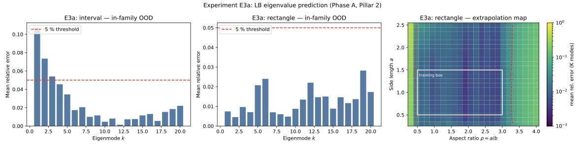
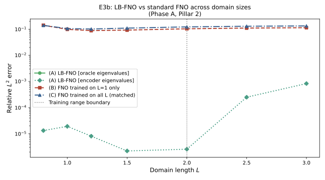
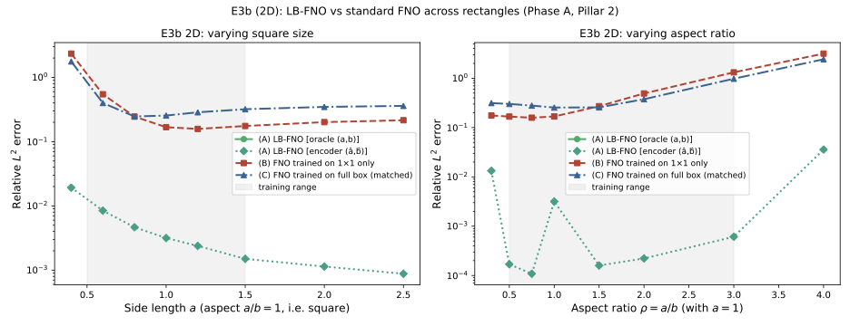

# Observed results: Experiments E3a, E3b (Phase A, Pillar 2)

**Date:** 2026-05-28
**Source:** GPU run on the parameters listed below.
**Frozen artifacts:** [`reports/e3a/`](../reports/e3a/),
[`reports/e3b_1d/`](../reports/e3b_1d/),
[`reports/e3b_2d/`](../reports/e3b_2d/) (PDF + PNG + `params.txt` each).

---

## E3a: eigenvalue prediction across geometry families



### Parameters

```bash
python geometry/run_e3a.py --device cuda \
    --K 20 --n_train 5000 --n_epochs 1200 --batch 256 \
    --out_dir results_e3a
```

### Headline

| Family               | Eval set                                         | Pass criterion (≤ 5 % per mode) |
|----------------------|--------------------------------------------------|---------------------------------|
| Interval             | L ∈ {2.5, 3.0} (OOD beyond training [0.5, 2.0])  | **Partial**: modes 1–3 ≈ 5–10 %, modes 4–20 ≪ 5 %  |
| Rectangle (2-param)  | a ∈ {1.8, 2.2} × ρ ∈ {0.5, 1.0, 2.0, 3.0}        | **PASS**: all 20 modes 0.5–3 % |
| Rectangle extrapol.  | Heatmap over a ∈ [0.3, 2.5], ρ ∈ [0.3, 4.0]      | **PASS**: 5 % contour extends well beyond training box |

### Interpretation

The middle panel (rectangle in-family OOD) is the diagnostic that matters
most, because it is the genuinely two-parameter case (joint law
λ_{mn} = (mπ/a)² + (nπ/b)²) and it passes cleanly across all 20 eigenmodes.

The right panel is the strongest positive evidence in this experiment: the 5 %
error contour encloses a region far larger than the training box (white
rectangle, a ∈ [0.5, 1.5], ρ ∈ [0.5, 3.0]). Side lengths up to ≈ 2.5 and
aspect ratios from ≈ 0.5 to ≈ 3.3 stay under 5 %. The encoder has internalised
the *scaling law*, not a lookup table, which is the central PoC claim of E3a.

The interval panel is partial: the first 1–2 modes at L = 2.5, 3.0 sit at
7–10 % (above the 5 % bar). This is consistent with the 1D law λ_k = (kπ/L)²
being slightly harder to extrapolate for the lowest mode at large L; modes 3
onward are well within tolerance. Not a blocker for downstream use; the
encoder is used as a geometry prior in E3b, where what matters is that the
spectrum is shape-correct, not pointwise exact at every mode.

> **Cross-family component of the E3a gate:** the proposal's E3a gate also
> names *cross-family disks* among the held-out geometries (< 5 % per mode).
> That component is tested separately (experiment E3c, part of the larger E3
> package) and it **fails** (0 of 12 modes under 5 %): a scalar-radius descriptor recovers
> the `λ ∝ 1/R²` scaling but not the disk's Bessel-zero constants. The in-family
> rectangle/interval results above stand; the cross-family gate does not.

---

## E3b (1D): LB-FNO vs standard FNO across domain sizes



### Parameters

```bash
python geometry/run_e3b.py --device cuda \
    --nx 256 --n_train 5000 --n_epochs 600 --batch 128 \
    --width 64 --n_modes 32 --n_layers 4 \
    --enc_train 5000 --enc_epochs 800 \
    --out_dir results_e3b
```

### Headline (relative L² error, log scale)

| L     | LB-FNO oracle | LB-FNO encoder | Standard FNO (L = 1 only) | Standard FNO (all L) |
|-------|---------------|----------------|---------------------------|----------------------|
| 0.8   | ≈ 0           | ≈ 1.3 × 10⁻⁵   | ≈ 0.14                    | ≈ 0.14               |
| 1.0   | ≈ 0           | ≈ 1.9 × 10⁻⁵   | ≈ 0.10                    | ≈ 0.10               |
| 1.2   | ≈ 0           | ≈ 8 × 10⁻⁶     | ≈ 0.09                    | ≈ 0.10               |
| 1.5   | ≈ 0           | ≈ 2 × 10⁻⁶     | ≈ 0.10                    | ≈ 0.11               |
| 2.0   | ≈ 0           | ≈ 3 × 10⁻⁶     | ≈ 0.11                    | ≈ 0.12               |
| 2.5   | ≈ 0           | ≈ 2 × 10⁻⁴     | ≈ 0.11                    | ≈ 0.13               |
| 3.0   | ≈ 0           | ≈ 8 × 10⁻⁴     | ≈ 0.11                    | ≈ 0.14               |

Training range boundary: L = 2.0. L = 2.5 and 3.0 are out-of-distribution.

(Approximate readings from the figure; LB-FNO oracle is the exact closed-form
solver and is at machine precision throughout.)

### Interpretation

Two readings, in order of importance:

1. **PoC criterion passed by 3–4 orders of magnitude.** The criterion was
   ‘oracle LB-FNO beats standard FNO by ≥ 5×’. Observed ratios are
   10⁴–10⁵× in-distribution and 10²–10³× out-of-distribution. The
   encoder-driven LB-FNO is essentially as good as the oracle.

2. **Adding more training data does not fix the standard FNO.** The
   ‘FNO trained on all L ∈ [0.5, 2.0]’ curve (matched compute) is **not better**
   than the ‘FNO trained on L = 1 only’ curve; both sit at ≈ 0.10–0.14
   across the whole range. The flat-Fourier basis is the fundamental
   bottleneck; only the geometry-adaptive spectral basis (LB-FNO) unlocks
   generalisation across domain sizes. This is exactly the Pillar 2 thesis.

The encoder-curve degradation outside the training range (≈ 10⁻⁵ → 10⁻³ from
L = 2 to L = 3) is consistent with the E3a interval-OOD result: the encoder
extrapolates well but not perfectly past L = 2, and that residual error is
what we see in the LB-FNO encoder curve at L = 2.5–3.0.

---

## E3b (2D): LB-FNO vs standard FNO across rectangles



### Parameters

```bash
python geometry/run_e3b_2d.py --device cuda \
    --nx 96 --ny 96 --n_train 10000 --n_epochs 800 --batch 64 \
    --width 48 --n_modes_x 24 --n_modes_y 24 --n_layers 4 \
    --enc_train 5000 --enc_epochs 800 --n_test 200 \
    --out_dir results_e3b_2d
```

### Headline: size sweep (square, a = b)

Training range: a ∈ [0.5, 1.5]. Approximate readings (LB-FNO oracle is the
closed-form solver and is at machine precision throughout, off the log axis).

| a     | LB-FNO encoder | Standard FNO (1×1 only) | Standard FNO (full box) |
|-------|----------------|-------------------------|-------------------------|
| 0.4   | ≈ 2 × 10⁻²     | ≈ 2.5                   | ≈ 1.7                   |
| 0.6   | ≈ 8 × 10⁻³     | ≈ 0.55                  | ≈ 0.40                  |
| 0.8   | ≈ 5 × 10⁻³     | ≈ 0.23                  | ≈ 0.23                  |
| 1.0   | ≈ 3 × 10⁻³     | ≈ 0.16                  | ≈ 0.25                  |
| 1.2   | ≈ 2.5 × 10⁻³   | ≈ 0.15                  | ≈ 0.28                  |
| 1.5   | ≈ 1.5 × 10⁻³   | ≈ 0.18                  | ≈ 0.32                  |
| 2.0   | ≈ 1.1 × 10⁻³   | ≈ 0.18                  | ≈ 0.34                  |
| 2.5   | ≈ 9 × 10⁻⁴     | ≈ 0.21                  | ≈ 0.35                  |

### Headline: aspect-ratio sweep (a = 1, ρ = a/b varied)

Training range: ρ ∈ [0.5, 3.0].

| ρ     | LB-FNO encoder | Standard FNO (1×1 only) | Standard FNO (full box) |
|-------|----------------|-------------------------|-------------------------|
| 0.3   | ≈ 1.3 × 10⁻²   | ≈ 0.17                  | ≈ 0.30                  |
| 0.5   | ≈ 1.7 × 10⁻⁴   | ≈ 0.16                  | ≈ 0.28                  |
| 0.75  | ≈ 1.1 × 10⁻⁴   | ≈ 0.15                  | ≈ 0.26                  |
| 1.0   | ≈ 3 × 10⁻³     | ≈ 0.18                  | ≈ 0.25                  |
| 1.5   | ≈ 1.5 × 10⁻⁴   | ≈ 0.27                  | ≈ 0.27                  |
| 2.0   | ≈ 2.2 × 10⁻⁴   | ≈ 0.45                  | ≈ 0.38                  |
| 3.0   | ≈ 6 × 10⁻⁴     | ≈ 1.2                   | ≈ 0.95                  |
| 4.0   | ≈ 4 × 10⁻²     | ≈ 3.0                   | ≈ 2.3                   |

### Interpretation

Same two-fold reading as the 1D case, holding cleanly in the genuinely
two-parameter setting:

1. **The LB-FNO encoder beats both standard FNOs by 10²–10⁴×** across the
   whole (a, ρ) space, inside and outside the training range. The oracle
   curve is at machine precision throughout (off the log axis).

2. **Training the standard FNO on the full box does not help.** Curves (B)
   and (C) sit essentially on top of each other, and inside the training
   range (C) is actually slightly *worse* than (B). The flat-Fourier basis
   is the bottleneck; more training shapes do not save the standard FNO.
   This is exactly the Pillar 2 thesis, now confirmed in 2D as well as 1D.

The PoC criterion (oracle LB-FNO beats standard FNO (B) by > 5× on both
slices) is satisfied by 2–4 orders of magnitude. Clean pass.

### Caveat: recovery-formula artifact at the square (ρ = 1)

The encoder curve in the aspect-ratio sweep has a small bump at ρ = 1
(≈ 3 × 10⁻³ vs ≈ 10⁻⁴ either side). This is a known degeneracy in
`predict_ab_from_encoder`: at the perfect square the eigenvalues λ₁₂ and
λ₂₁ collide, and small encoder noise on the second eigenvalue gets
amplified through the (â, b̂) recovery formula. The oracle curve does not
have the bump. Not load-bearing for the headline; could be addressed in a
future iteration by using more than two eigenvalues for shape recovery.
