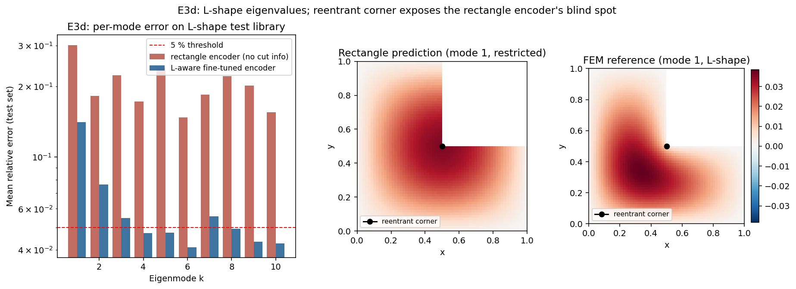

# Observed results: Experiment E3d (Phase A, Pillar 2)

**Date:** 2026-05-30
**Source:** GPU run (NVIDIA A40, torch 2.5.1, CUDA). Wall time **141.9 s**.
**Frozen artifacts:** [`reports/e3d/`](../reports/e3d/) (PDF + PNG + `params.txt` + raw JSON).



## Setup

The non-convex test for the Pillar 2 encoder: an L-shape (a rectangle with a
rectangular corner removed) has a re-entrant corner whose `r^(2/3)` singularity
distorts the low eigenmodes. Two *different* encoders are compared against a
five-point finite-difference masked-grid eigensolver (`nx = ny = 64`), `K = 10`:

- **(A) Rectangle encoder, zero-shot:** the convex two-parameter
  `EigenvalueEncoder(d_in=2)` from the E3a task, applied to the L-shape's
  bounding rectangle (it has no input for the cut, so it cannot see the
  non-convexity).
- **(B) L-aware encoder:** a *fresh* `EigenvalueEncoder(d_in=4)` consuming
  `(a, b, cx, cy)`, trained from scratch on a small library of 200 L-shapes
  (the spec calls this the "fine-tune" phase, but no weights transfer from the
  rectangle encoder; it is a separate model).

**Pre-registered hypothesis:** the rectangle encoder only partially recovers the
L-shape spectrum (Weyl asymptotics carry it part of the way), but the re-entrant
`r^(2/3)` singularity in the lowest modes drives per-mode errors well above 5%
unless the encoder is exposed to the cut dimensions directly. PoC PASS: at least
6 of 10 modes under 5%.

## Parameters

```bash
python geometry/run_e3d.py --device cuda --out_dir results_e3d
```

GPU defaults: `--K 10 --n_rect_train 5000 --n_rect_epochs 1200 --n_lshape_train
200 --n_lshape_test 40 --n_finetune_epochs 200 --batch 128 --lr_rect 0.003
--lr_finetune 0.002 --nx_fem 64 --ny_fem 64 --seed 0`.

## Headline numbers

| Condition                          | Mean rel-err | Modes < 5% (PoC needs >= 6) | Mode-1 err |
|------------------------------------|--------------|-----------------------------|------------|
| (A) Rectangle encoder, zero-shot   | 0.203        | **0 of 10**                 | 0.301      |
| (B) L-aware encoder (fresh, d_in=4)| 0.060        | **6 of 10** (PoC PASS)      | 0.141      |

L-aware per-mode error (modes 1 to 10): 0.141, 0.076, 0.055, 0.047, 0.048,
0.041, 0.056, 0.049, 0.043, 0.043. Four modes still exceed 5%: mode 1 (14.1%),
mode 2 (7.6%), mode 3 (5.5%), mode 7 (5.6%). The pass is met at **exactly 6/10
with essentially zero margin** (single seed, no error bars).

## Interpretation

**1. The convex encoder has a genuine non-convex blind spot, but most of it is
the area term, not the corner.** The rectangle encoder fails zero-shot (0/10,
20.3% mean, mode-1 30%), and its signed error is uniformly negative: it
*under-predicts* every L-shape eigenvalue, because the bounding rectangle has
more area than the L-shape and smaller domains have larger eigenvalues (Weyl).
Correcting only for the area shrinkage already brings the rectangle prediction to
about 7.2% mean error and 3/10 modes under 5%. So roughly two-thirds of the 20%
gap is a scalar area/Weyl effect that a richer descriptor fixes cheaply; the
re-entrant `r^(2/3)` singularity is the *residual* on top of that, concentrated
in the lowest mode.

**2. A small in-family library plus the cut descriptor clears the PoC.** The
fresh four-input encoder, trained on 200 L-shapes, reaches 6/10 modes under 5%
(mean 6%), passing the gate. This cures the convex blind spot: once the model can
see the cut `(cx, cy)`, it represents the L-shape spectrum well for most modes.
This is an in-family expressivity result (the 40-shape test set is drawn from the
same distribution as the 200-shape training set, only a different seed), so it is
weaker in class than the E3a / E3b *extrapolation* positives, and it is not
zero-shot.

**3. The corner singularity is the clear residual in mode 1.** Mode 1 stays at
14% even after training (down from 30%), the largest residual, consistent with
the `r^(2/3)` singularity being the hardest spectral feature to fit; the figure
shows the true mode-1 pushed away from the re-entrant corner while the rectangle
prediction ignores it. Modes 2 and 3 (7.6%, 5.5%) are plausibly the next tail of
the same effect. Mode 7 (5.6%) is a non-monotone exceedance not explained by the
lowest-mode-singularity story and is most likely small-library fit noise (the
training loss plateaued at `6e-3`, well above the rectangle encoder's `2.5e-5`).

## Verdict

**Partial / qualified positive for Pillar 2 (fragile).** The honest scientific
statement: a convex-only encoder genuinely fails
on a non-convex re-entrant geometry (0/10 zero-shot), and giving the model the
cut descriptor plus a small in-family training library recovers it to the 6/10
gate. This reinforces the cross-family design lesson (a richer descriptor plus
in-family examples works; a scalar descriptor with zero examples fails). But the positive is qualified on three counts that should travel with it:

- It is **in-family expressivity, not generalization**: train and test shapes
  come from the same distribution, so this is weaker than the E3a / E3b
  extrapolation positives and must not be read as comparable to them.
- It is **not zero-shot**: the proposal's Milestone 1 promises generalization
  "without retraining", and the Milestone-1-relevant condition is the zero-shot
  rectangle baseline (A), which fails. Condition (B) trains a new encoder on the
  new family.
- The pass is **fragile**: exactly 6/10 with two failing modes (3 at 5.5%, 7 at
  5.6%) within ~0.6 percentage points of the line, single seed, no error bars.

In the Pillar 2 picture: E3a / E3b are the strong intra-family extrapolation
positives, cross-family transfer from a scalar descriptor is the documented miss
(part of the larger package), and E3d sits between them as a curable in-family
blind spot.

## Caveats and scope

- Accuracy / expressivity result only; no data-efficiency or generalization
  claim.
- The reference is a five-point finite-difference masked-grid solver, not a true
  FEM solver. At `64 x 64` it is not grid-converged at the `r^(2/3)` corner
  (the mode-1 eigenvalue is ~2% below the continuum value and still rising at
  `nx = 128`). The grid error largely cancels in the encoder-vs-reference metric,
  but the absolute "reproduces the L spectrum" claim is only relative to the
  `64 x 64` reference.
- A multi-seed run is recommended before treating 6/10 as robust, given the
  zero-margin pass.
- Figure note: the middle panel is the analytic `sin(pi x) sin(pi y)` restricted
  to the L-mask (an illustration of what the rectangle prediction "sees"), not a
  model output (the encoder predicts eigenvalues only); the heatmaps use a fixed
  symmetric visualisation shape (`a = b = 1`, a `0.5 x 0.5` cut), not a test
  shape; the bar-chart y-axis is log-scaled.
