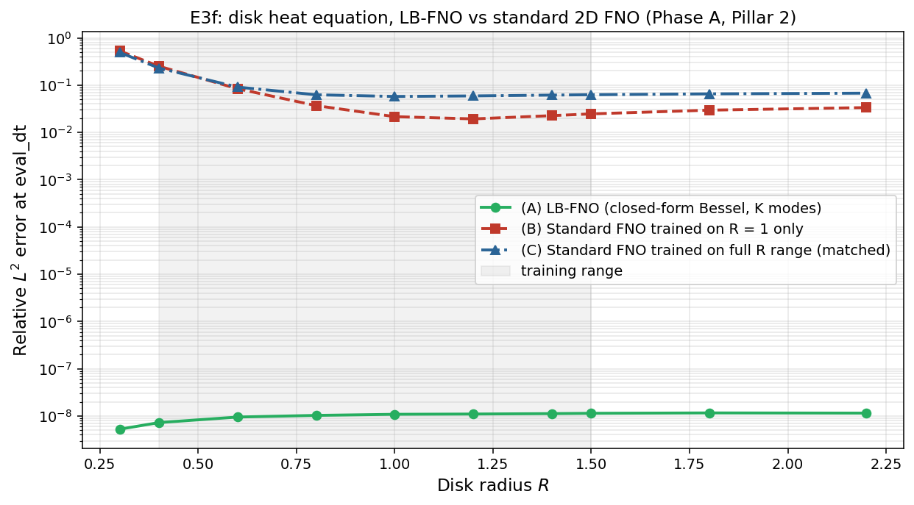

# Observed results: Experiment E3f (Phase A, Pillar 2)

**Date:** 2026-05-30
**Source:** GPU run (NVIDIA A40, torch 2.5.1, CUDA). Wall time **16313.1 s** (about 4.5 h).
**Frozen artifacts:** [`reports/e3f/`](../reports/e3f/) (PDF + PNG + `params.txt` + raw JSON).



## Setup

The disk analogue of E3b: heat equation `∂t u = D Δu` on a disk of radius `R`,
Dirichlet BC, with a closed-form Bessel solution. Three methods compared over a
radius sweep:

- **(A) LB-FNO (closed-form Bessel):** the analytic Bessel expansion using the
  *oracle* eigenvalues `λ_{mn} = (z_{mn}/R)^2` computed directly from `R`. This is
  not the learned encoder; it is the closed-form solver with `K = 24` modes.
- **(B) Standard 2D FNO trained on `R = 1` only.**
- **(C) Standard 2D FNO trained on the full radius range** (a uniform grid
  `linspace(0.4, 1.5, 10)`).

Radii evaluated: `[0.3, 0.4, 0.6, 0.8, 1.0, 1.2, 1.4, 1.5, 1.8, 2.2]`; training
range `[0.4, 1.5]`, so `R = 0.3` (small disk) and `R = 1.8, 2.2` are OOD.

**Pre-registered hypothesis:** the LB-FNO beats a standard 2D FNO by at least one
order of magnitude across `R ∈ [0.4, 1.5]`.

## Parameters

```bash
python geometry/run_e3f.py --device cuda --out_dir results_e3f
```

GPU defaults: `--nx 96 --n_train 10000 --n_epochs 800 --batch 64 --width 48
--n_modes_x 24 --n_modes_y 24 --n_layers 4 --n_test 200 --R_min 0.4 --R_max 1.5
--K 24 --eval_dt 0.01`.

## Headline numbers

| Method                        | Mean rel-err in-band | Mean rel-err OOD |
|-------------------------------|----------------------|------------------|
| (A) LB-FNO (closed-form Bessel)| 1.0e-8 (round-off)  | 9.5e-9           |
| (B) Standard FNO, `R = 1`      | 0.066                | 0.198            |
| (C) Standard FNO, full range   | 0.089                | 0.208            |

Reported ratios: B/A in-band `6.4e6`, C/A in-band `8.7e6`. Per-radius: B ranges
0.019 (R=1.2) to 0.53 (R=0.3); at the training radius `R = 1.0`, B = 0.022. C is
>= B at every in-band radius.

## Interpretation

The literal "LB-FNO is `~10^6` times more accurate" reading is not a fair
like-for-like comparison, and the honest finding is narrower but still supports
Pillar 2. Three things have to be separated.

**1. Method A is essentially the analytic solution scored against itself, so its
`~1e-8` is round-off, not a measured modeling gain.** The test initial conditions
are band-limited to at most 16 Bessel modes, which lie entirely inside A's
`K = 24` basis, and A is scored against a `K = 72` copy of the *same* closed-form
solver. So there is no real truncation gap for A to incur; its error is `pinv`
numerical noise. The `6.4e6` and `8.7e6` ratios are arithmetically correct but
compare "exact solver vs itself" (A) against "neural net vs solver" (B, C). A is
structurally guaranteed to win. (The script docstrings claiming this "measures the
basis-truncation error rather than zero" overstate it for this band-limited IC
family.)

**2. The flat-Fourier FNO carries an irreducible floor that is partly D-blindness,
not just the basis.** The FNO receives only `(u0, dt)` as input channels and never
sees the diffusivity `D ~ U(0.01, 0.20)`, so it must average over `D` and cannot
be exact even at the training radius; this is the ~0.02 floor of B at `R = 1`, and
it is a conditioning handicap unrelated to the spectral basis.

**3. The genuinely fair, informative signals do support the pillar.** Two
comparisons here are like-for-like (real trained FNO vs real trained FNO, or vs
the analytic reference) and they reproduce the E3b story:

- **Training on more radii does not help (C >= B everywhere in-band).** Exactly as
  in [E3b](results.md): the flat-Fourier basis is the bottleneck, and feeding the
  FNO more shapes does not fix it.
- **The flat FNO degrades as the disk leaves the trained radius**, worst at the
  small disk `R = 0.3` (B = 0.53, C = 0.49); large-`R` OOD (1.8, 2.2) is mild
  (~0.03 to 0.07). The geometry-adapted Bessel basis, by contrast, represents the
  solution at any `R` by construction.

So the defensible Pillar 2 statement is: **the disk-heat solution lives in the
geometry-adapted Bessel basis (the LB-FNO represents it exactly), while a
flat-Fourier FNO cannot, and adding training shapes does not rescue it.** That is
the spectral-basis thesis, confirmed on disks. What this run does *not* establish
is a million-fold modeling advantage of a learned operator.

## Verdict

**Partial / qualified positive for the Pillar 2 architecture thesis (architecture
/ oracle).** It is the disk counterpart of E3b's *oracle* curve, and it confirms
that the basis choice is decisive on disks.
Two qualifiers must travel with it:

- It uses **oracle Bessel eigenvalues, not the encoder**, and the encoder-to-basis
  step fails on disks (0 of 12 modes; cross-family transfer from a scalar radius
  descriptor is studied separately, in the larger E3 package). E3b's headline was the
  *encoder-driven* LB-FNO curve, which E3f does **not** reproduce, so E3f is
  strictly weaker than E3b: it shows the basis is right, not that the pipeline that
  must supply it works for disks.
- The headline `~10^6` ratio is **not a fair comparison** (self-scoring A on
  band-limited ICs; D-blind FNOs). The citable claim is the qualitative basis
  thesis, not the magnitude.

## Caveats and scope

- Accuracy result only; no data-efficiency claim. A's in-band/OOD split is vacuous
  (A never trains).
- A fairer re-run is recommended before citing any magnitude: give the FNO the `D`
  input, use broadband (not 16-mode-band-limited) ICs, score A against an
  independent fine-grid reference, and add the encoder-driven LB-FNO curve. This is
  tracked in the internal re-run notes.
- `C` trains on a uniform radius grid that does not coincide with the eval radii,
  so its in-band numbers are mild interpolation, not memorisation.
