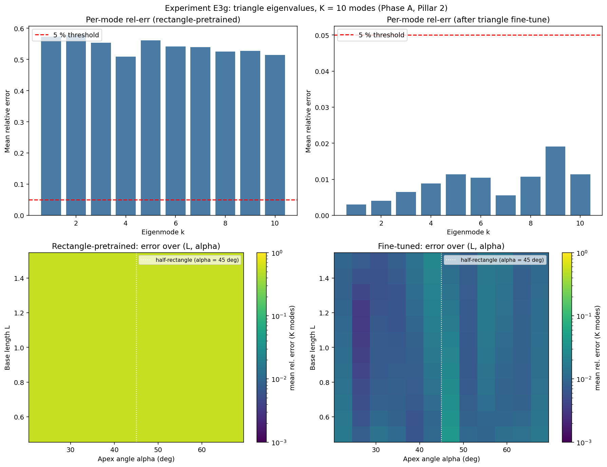

# Observed results: Experiment E3g (Phase A, Pillar 2)

**Date:** 2026-05-30
**Source:** GPU run (NVIDIA A40, torch 2.5.1, CUDA). Wall time **91.5 s**.
**Frozen artifacts:** [`reports/e3g/`](../reports/e3g/) (PDF + PNG + `params.txt` + raw JSON).



## Setup

A genuinely non-product geometry: triangles parametrised by base length `L` and
apex angle `alpha`, with ground-truth eigenvalues from a `40 x 40` sparse
Dirichlet Laplacian eigensolve, `K = 10`. Two conditions, both using the same
two-parameter *bounding-rectangle* descriptor `(L, L tan(alpha))`:

- **(A) Rectangle-pretrained encoder, zero-shot:** the E3a-style
  `EigenvalueEncoder(d_in=2)` applied directly to triangles.
- **(B) Fine-tuned encoder:** the *same* encoder object, fine-tuned on a small
  triangle library (400 shapes, 200 epochs). Weights transfer from (A); this is a
  genuine fine-tune, not a fresh model (contrast [E3d](results_e3d.md), whose
  L-aware condition was a fresh `d_in=4` encoder).

**Pre-registered hypothesis:** the rectangle encoder transfers to right triangles
via the bounding-rectangle descriptor, with error correlated to how far `alpha`
is from `pi/4` (the half-rectangle case), and a short fine-tune should close the
gap, especially in the skew regime.

## Parameters

```bash
python geometry/run_e3g.py --device cuda --out_dir results_e3g
```

GPU defaults: `--K 10 --n_rect_train 5000 --n_rect_epochs 600 --rect_batch 128
--n_triangle_train 400 --n_triangle_test 200 --n_finetune_epochs 200
--finetune_batch 64 --finetune_lr 0.001 --fem_nx 40 --fem_ny 40 --map_nL 12
--map_nalpha 12`. Triangle distribution `L ∈ (0.6, 1.4)`, `alpha ∈ (pi/8, 3pi/8)`
i.e. `(22.5deg, 67.5deg)`.

## Headline numbers

(All "mean" figures below are per-sample means unless stated.)

| Condition                    | Mean rel-err | Modes < 5% | Frac of (L,alpha) grid < 5% |
|------------------------------|--------------|------------|------------------------------|
| (A) Rectangle, zero-shot     | 0.542 (54%)  | **0 of 10**| 0.0                          |
| (B) Fine-tuned (same encoder)| 0.0103 (1.0%)| **10 of 10**| **1.0**                     |

Zero-shot near-45deg mean 0.5418 vs skew mean 0.5427 (a 0.085 percentage-point
difference). Fine-tuned per-mode error 0.003 to 0.019; per-mode mean 0.91%, grid
mean 1.12%; the worst single grid cell is 4.0% (at `alpha ~ 47deg`, smallest `L`).

## Interpretation

**1. The zero-shot transfer hypothesis is cleanly refuted, including its
alpha-correlation prediction.** The rectangle encoder returns a confident *wrong
answer*: a uniform ~54% error across the entire `(L, alpha)` grid (per-column
standard deviation 0.17%), with **no dip at the 45deg half-rectangle line** that
the hypothesis predicted as the sweet spot. An independent recompute of the
bounding-rectangle Dirichlet spectrum against the FEM triangle spectrum reproduces
this flat ~54% offset. The intuition that a right-isoceles triangle is "half a
square" so should transfer is wrong: the Dirichlet condition on the hypotenuse
changes the spectrum (the triangle's modes are a folded subset of the square's,
not the full rectangle spectrum), and the bounding-rectangle descriptor cannot see
this even at `alpha = pi/4`.

**2. The fine-tune closes the gap cleanly: 10 of 10 modes under 5%, every grid
point under 5%.** With 400 triangles and 200 epochs the same encoder reaches ~1%
mean error and passes at every `(L, alpha)` grid point. This is the cleanest pass
of the in-family geometry encoders reviewed here (E3d, E3g): where the L-shape
([E3d](results_e3d.md)) managed a fragile 6 of 10, the triangle reaches a uniform
10 of 10. Two reasons, and only one of them is about the method: triangles are a
*smoother* geometry (no re-entrant `r^(2/3)` singularity, so the FEM reference is
well converged), and E3g fine-tunes an already-trained encoder rather than
training a fresh one. So this is a cleaner pass on an easier geometry, not
evidence that the triangle method is intrinsically more robust. The faint
higher-error band near `alpha ~ 45-50deg` (worst cell 4.0%) is the thinnest
margin; everything still clears 5%.

## Verdict

**Positive (qualified) for Pillar 2.** A genuinely
non-product geometry (triangles) is learned to 10/10 modes under 5% across the
whole `(L, alpha)` grid by fine-tuning the encoder on a small in-family library.
The same qualifiers as [E3d](results_e3d.md) apply and should travel with it:

- It is **in-family expressivity, not zero-shot generalization**: train and test
  triangles come from the same `(L, alpha)` distribution (different seeds). The
  zero-shot transfer that motivated the experiment fails (54%, 0/10).
- It is **fine-tune-driven**: the result rests on the 400-shape fine-tune, which
  starts from the broken ~55% zero-shot level. There is no fresh-encoder ablation,
  so this should be read as "fine-tuning on triangles works", not "rectangle
  pretraining transfers to triangles".
- The pass is a **single-seed point estimate** (no error bars), and the
  alpha-correlation half of the hypothesis is refuted.

## Caveats and scope

- Ground truth and fine-tune targets both come from the same `40 x 40` sparse
  Dirichlet Laplacian eigensolve, so the 1% figure is encoder-vs-FEM agreement,
  not encoder-vs-continuum. Benign here: triangles are smooth and the FEM is
  converged to ~0.16% (lambda_1) and ~1.3% (lambda_10).
- Single seed (`seed = 0`; train seed 20202, test seed 10101). The 10/10 and
  frac-grid 1.0 are point estimates.
- The skew band is narrow (`alpha` down to 22.5deg), so "skew" here is only mildly
  skew; the refutation of the alpha-correlation holds regardless.
- Accuracy / expressivity result only; no data-efficiency claim.
