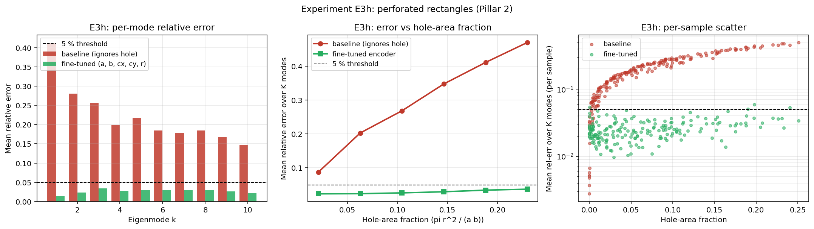

# Observed results: Experiment E3h (Phase A, Pillar 2)

**Date:** 2026-05-30
**Source:** GPU run (NVIDIA A40, torch 2.5.1, CUDA). Wall time **485.6 s** (about 8 min).
**Frozen artifacts:** [`reports/e3h/`](../reports/e3h/) (PDF + PNG + `params.txt` + raw JSON).



## Setup

A multiply-connected (holed) geometry: rectangles `[0, a] x [0, b]` with a circular
hole `B((cx, cy), r)` removed. Reference eigenvalues come from a five-point
finite-difference masked-grid eigensolver (`nx = 64`, the hole staircased out),
`K = 10`. Two encoders:

- **(A) Baseline:** the plain rectangle encoder that sees only `(a, b)` and ignores
  the hole.
- **(B) Hole-aware encoder:** a *fresh* `EigenvalueEncoder(d_in=5)` consuming
  `(a, b, cx, cy, r)`, trained from scratch on a 2000-shape perforated-rectangle
  library. (The spec, JSON, and figure legend call this "fine-tuned", but the code
  trains a fresh `d_in=5` model with no weight transfer from the `d_in=2` baseline;
  it is the same fresh-encoder pattern as [E3d](results_e3d.md), not a fine-tune
  like [E3g](results_e3g.md).)

**Pre-registered hypothesis:** a circular hole shifts the Dirichlet spectrum
predictably (a Rayleigh-quotient perturbation tied to the hole-area fraction); the
descriptor-aware encoder should recover the perturbed eigenvalues, while the
hole-ignoring baseline degrades as the hole area grows.

## Parameters

```bash
python geometry/run_e3h.py --device cuda --out_dir results_e3h
```

GPU defaults: `--K 10 --n_rect_pretrain 2000 --n_rect_pretrain_epochs 600
--n_perf_train 2000 --n_perf_test 200 --n_epochs 600 --batch 64 --lr 0.003
--fem_nx 64 --n_area_bins 6`. Tested hole-area fraction ~0.02 to ~0.25; holes
constrained strictly interior (8% margin, no boundary-touching).

## Headline numbers

| Encoder                         | Mean rel-err | Modes < 5% | 
|---------------------------------|--------------|------------|
| (A) Baseline (ignores hole)     | 0.195 (19.5%)| **0 of 10**|
| (B) Hole-aware (fresh d_in=5)   | 0.0257 (2.6%)| **10 of 10**|

Error vs hole-area fraction (bin centres 0.021 to 0.230; bin counts
`[89, 42, 35, 15, 13, 6]`):

| Hole-area bin | 0.021 | 0.063 | 0.104 | 0.146 | 0.188 | 0.230 |
|---------------|-------|-------|-------|-------|-------|-------|
| (A) Baseline  | 0.087 | 0.203 | 0.268 | 0.347 | 0.411 | 0.470 |
| (B) Hole-aware| 0.024 | 0.024 | 0.026 | 0.030 | 0.034 | 0.037 |

(The 19.5% baseline mean is the pooled mean over all 200 x 10 sample-mode pairs;
the mean of the 10 per-mode values is 22.3%. The two highest-area bins hold only
13 and 6 of the 200 test shapes, so their endpoints are small-sample estimates.)

## Interpretation

**1. The hole-ignoring baseline degrades monotonically with hole-area fraction.**
Removing area raises the eigenvalues (domain monotonicity), so the baseline, which
returns the unperforated rectangle spectrum, systematically *under-predicts*
(uniformly negative signed error) and its error climbs from 8.7% at the smallest
holes to 47% at the largest. This is consistent with the Rayleigh-quotient /
domain-monotonicity picture the hypothesis invoked; the empirical shift is
sub-linear in area (log-log slope ~0.5, i.e. roughly proportional to the hole
radius), not a unit-slope-in-area law, so we state the direction and monotonicity
rather than a precise proportionality.

**2. The hole-aware encoder recovers the perturbed spectrum: 10 of 10 modes under
5%.** Given `(a, b, cx, cy, r)` and a small in-family library, the fresh `d_in=5`
encoder reaches 2.6% mean error and clears 5% on every mode-averaged eigenvalue,
staying under 5% across the whole hole-area range (2.4% at small holes rising
gently to 3.7% at the largest). The big-hole cases are slightly harder but still
pass on the mode average. (Note "10 of 10" refers to the mode-averaged errors;
the per-sample scatter shows some individual large-hole shapes above 5%.)

So both halves of the hypothesis hold: the baseline degrades with hole area (the
perturbation is real and monotone), and the descriptor-aware encoder learns it.

## Verdict

**Positive (qualified) for Pillar 2.** A multiply-connected
geometry (rectangle with a hole) is learned to 10/10 mode-averaged eigenvalues
under 5% by a fresh hole-descriptor encoder on a small in-family library, while
the hole-blind baseline fails in a physically interpretable way (monotone in hole
area). It carries the same qualifiers as [E3d](results_e3d.md) / [E3g](results_e3g.md):

- **In-family expressivity, not zero-shot generalization**: train and test
  perforated rectangles come from the same generator (train seed 101, test seed
  202). The Milestone-1 "without retraining" condition is the zero-shot baseline
  (A), which fails 0/10 by design.
- **Library- and descriptor-dependent**: the win rests on the 2000-shape library
  and the explicit `(a, b, cx, cy, r)` descriptor (a *fresh* encoder, not a
  fine-tune).
- **Single seed** (`seed = 0`), no error bars; the large-hole tail is thin
  (n = 13 and n = 6). The load-bearing statistics are the monotone trend and the
  per-mode 10/10 over the full 200-shape test, not the precise tail endpoints.

## Caveats and scope

- The reference is a five-point finite-difference masked-grid eigensolver
  (staircased hole), not a true FEM solver; the 2.6% figure is encoder-vs-`64x64`
  agreement, not encoder-vs-continuum. The reference is accurate to ~0.3% vs the
  closed form at `r -> 0`, so the perf error is genuine signal above the grid
  floor; grid error largely cancels since the perf encoder's targets and the test
  targets share the same solver.
- Minor non-apples-to-apples detail: the baseline is trained on closed-form
  rectangle eigenvalues while the perf encoder and all test targets use the
  FD-grid reference, adding a small (~0.3%) floor to the smallest-hole baseline
  bin. Negligible relative to the 8.7% to 47% baseline error.
- The log-space encoder floors `r` at `1e-3`; inert here (no test sample had
  `r = 0`). A multi-seed confirmation is cheap (~8 min) and recommended, as for
  E3d.
- Accuracy / expressivity result only; no data-efficiency claim.
