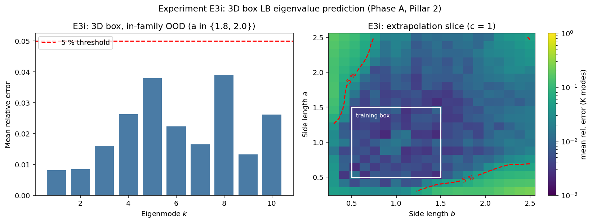

# Observed results: Experiment E3i (Phase A, Pillar 2)

**Date:** 2026-05-30
**Source:** GPU run (NVIDIA A40, torch 2.5.1, CUDA). Wall time **187.4 s** (about 3 min).
**Frozen artifacts:** [`reports/e3i/`](../reports/e3i/) (PDF + PNG + `params.txt` + raw JSON).



## Setup

The smallest test of "the LB-eigenvalue idea scales to 3D". The encoder is the
same log-log MLP as E3a but with `d_in = 3`, predicting the first `K = 10`
Dirichlet eigenvalues of a box `[0, a] x [0, b] x [0, c]`,
`λ_{nml} = π^2 (n^2/a^2 + m^2/b^2 + l^2/c^2)`. Trained on
`(a, b, c) ~ Uniform(0.5, 1.5)^3` against the closed-form formula.

Two evaluations:
- **In-family OOD (the headline bars):** `a ∈ {1.8, 2.0}` (extrapolated beyond
  the training range), with `b, c ∈ {0.6, 1.0, 1.4}` held *inside* `[0.5, 1.5]`.
  So this is **single-axis (a-only) size extrapolation**; `b` and `c` are
  interpolated. (The script docstring's "slightly beyond" for `b, c` is
  inaccurate; they stay in range.)
- **Extrapolation slice:** a 2D `(a, b)` map at fixed `c = 1`, with `a, b` run out
  to 2.5, probing joint two-axis extrapolation (the third axis pinned at the
  training-box centre).

**Pre-registered hypothesis:** the 2-parameter rectangle encoder extends to a
3-parameter box encoder, matching the E3a accuracy level (< 5% per-mode at
`K = 10`) on in-family OOD boxes.

## Parameters

```bash
python geometry/run_e3i.py --device cuda --out_dir results_e3i
```

GPU defaults: `--K 10 --n_train 10000 --n_epochs 1500 --batch 256 --seed 0`.
Final training log-MSE `5e-5`.

## Headline numbers

**Single-axis OOD** (`a ∈ {1.8, 2.0}`, `b, c` in range), per-mode error averaged
over the 18 OOD boxes:

| Quantity                       | Value           |
|--------------------------------|-----------------|
| Modes under 5% (PoC needs all) | **10 of 10** (PASS) |
| Max per-mode error             | 3.9% (mode 8; mode 5 = 3.8%, near-tie) |
| Mean per-mode error            | 2.1%            |

Per-mode (1 to 10): 0.008, 0.008, 0.016, 0.026, 0.038, 0.022, 0.016, 0.039,
0.013, 0.026. The higher modes sit nearer the 5% bar than the lowest (~0.8%).

**`(a, b)` extrapolation slice (`c = 1`):** 100% of the in-training-box cells pass
(max 1.55%); the 5% contour extends well beyond the box; about 14% of the
`[0.3, 2.5]^2` slice fails, concentrated in the two anisotropic far corners
(small-`a`/large-`b` reaching 23.8%, large-`a`/small-`b` reaching 16.8%). The raw
"85.75% under 5%" figure mixes interpolation and deep-OOD cells and is sensitive
to the chosen grid extent, so the contour reach is the more meaningful statement.

## Interpretation

**1. The encoder scales to 3D and extrapolates box size cleanly (single axis).**
All 10 mode-averaged eigenvalues clear 5% on the `a ∈ {1.8, 2.0}` OOD boxes
(max 3.9%, mean 2.1%), at a per-mode accuracy comparable to E3a's 2D rectangle
result, with a cheap encoder (3 min). The pre-registered hypothesis is met.

**2. It is genuine size extrapolation, the same axis as E3a, but narrower in
scope.** Unlike the in-family-fitting positives ([E3d](results_e3d.md),
[E3g](results_e3g.md), [E3h](results_e3h.md)), E3i extrapolates outside the
training box, so it is class-matched to [E3a](results.md) on the extrapolation
axis. The match is only partial, though: E3a's rectangle OOD effectively varied
two axes (it swept aspect ratio, so `b = a/rho` also left the range) at `K = 20`,
whereas E3i's headline bars vary a single axis at `K = 10`. The joint two-axis
stress lives only in the `c = 1` slice, where the bulk extrapolates but both
extreme-aspect-ratio corners fail.

**3. The scaling-law extrapolation is an architectural inductive bias, not
emergent discovery.** The encoder regresses eigenvalues in log-log space, which
makes the affine scaling law `log λ = ... - 2 log a - 2 log b - 2 log c` trivially
extrapolable by construction. So "the encoder internalised the 3D scaling law" is
accurate but should be read as the right inductive bias paying off, not as the
network discovering structure. What it does *not* do automatically is the
combinatorial mode selection at extreme aspect ratios, which is exactly where the
slice corners fail.

## Verdict

**Positive (moderate, qualified).** E3i confirms the Pillar
2 encoder extends to 3D and extrapolates box size to the E3a accuracy level, which
is the result the proposal needs for "the LB-eigenvalue idea scales to 3D". It
belongs with E3a/E3b on the extrapolation axis, but it is a *moderate* rather than
a hard-won positive, for reasons that should travel with it:

- The headline OOD is **single-axis** (`a` only); `b, c` are in range.
- The ground truth is **exact closed-form on a separable product geometry** (no
  FEM / discretisation noise, no non-product shapes), the easiest geometry class,
  and the log-log architecture makes the scaling law extrapolable by construction.
  So this is not "stronger" than the harder non-product positives (E3d/E3g/E3h);
  it is an easier test passed cleanly.
- **Single seed**; the higher modes sit near the 5% bar (mode 8 at 3.9%), so a
  different seed could plausibly nudge one mode over.

## Caveats and scope

- The "10/10 modes pass" is an aggregate over the 18 OOD boxes (per-mode
  ratio-of-means), not a per-box statement.
- A stronger 3D claim would extrapolate all three axes jointly (`b, c > 1.5` too);
  the `c = 1` slice partly probes this and shows corner failures, so a true
  three-axis OOD would likely exceed the 2.1% headline mean.
- Accuracy / expressivity result only; no data-efficiency claim. Wall time (187 s)
  is well under the spec's ~1 h budget, simply because the encoder is small.
- Documentation nit: the `run_e3i.py` docstring describes `b, c` as going
  "slightly beyond" the training range, but the OOD eval keeps them in range;
  comment-only, no number affected.
