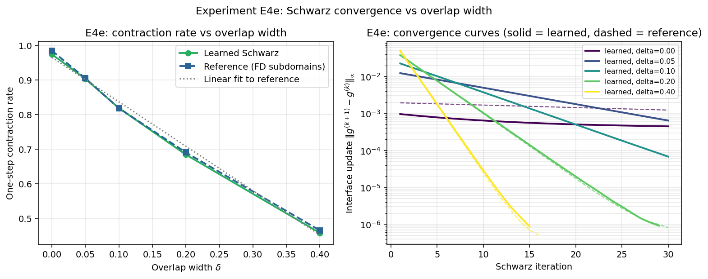

# Observed results: Experiment E4e (Phase A, Pillar 3)

**Date:** 2026-05-30
**Source:** GPU run (NVIDIA A40, torch 2.5.1, CUDA). Wall time **3452.2 s** (about 58 min).
**Frozen artifacts:** [`reports/e4e/`](../reports/e4e/) (PDF + PNG + `params.txt` + raw JSON).



## Setup

Does the *learned* DtN consensus inherit the classical overlap-dependence of
Schwarz convergence? The 1D Poisson problem `-∂xx u = f` on `[0, 1]` is split at
`x = 0.5` with overlap width `δ ∈ {0, 0.05, 0.1, 0.2, 0.4}`. Subdomain models are
trained jointly across overlaps via one-hot overlap-class conditioning. The
headline metric is the one-step **contraction rate** (the geometric-mean
per-iteration reduction factor of the interface increment `|g^(k+1) - g^(k)|`),
compared between the learned DtN and an *independent* classical finite-difference
Schwarz reference. `tol = 1e-6`.

**Pre-registered hypothesis:** overlapping Schwarz converges faster than
non-overlapping; the contraction rate decreases (roughly linearly) with overlap
width `δ` (Toselli-Widlund Theorem 2.4); and the learned DtN preserves this
dependence.

This is a 1D finite-difference experiment (banded tridiagonal solves, no spectral
transforms); the reference was reproduced bit-for-bit from its seeds in an
independent check.

## Parameters

```bash
python schwarz/run_e4e.py --device cuda --out_dir results_e4e
```

GPU defaults: `--overlaps 0.0 0.05 0.1 0.2 0.4 --nx_half 64 --n_train 5000
--n_epochs 600 --batch 64 --width 64 --n_modes 32 --n_layers 4 --n_test 200
--max_iter 30 --tol 1e-6`.

## Headline numbers

One-step contraction rate (lower = faster convergence):

| δ    | Learned DtN | Classical reference | rel. diff |
|------|-------------|---------------------|-----------|
| 0.00 | 0.974       | 0.985               | 1.1%      |
| 0.05 | 0.903       | 0.905               | 0.2%      |
| 0.10 | 0.819       | 0.818               | 0.03%     |
| 0.20 | 0.684       | 0.690               | 0.9%      |
| 0.40 | 0.458       | 0.465               | 1.6%      |

Linear fits to these points: slope **-1.287** (learned) vs **-1.284**
(reference), agreeing to 0.3%. Iterations to `tol` fall from the 30-sweep cap
(δ = 0) to ~15 (δ = 0.4).

## Interpretation

**1. Overlap accelerates convergence, and the learned DtN follows the classical
curve.** The contraction rate drops monotonically from ~0.98 to ~0.46 as `δ` goes
from 0 to 0.4 (iterations 30 to 15), and the learned-DtN rate tracks the
independent classical reference to within 1.6% at every overlap (slopes within
0.3%). The agreement is genuine, not circular: the reference is a standalone
finite-difference Schwarz solver (reproduced bit-for-bit from seeds), and the
learned and reference convergence histories are distinct trajectories. So the
learned consensus behaves like a proper DtN and inherits the classical Schwarz
convergence behaviour.

**2. The dependence is approximately, not exactly, linear.** A line fits the five
points well (R^2 ~ 0.99), but the exact 1D two-subdomain alternating-Schwarz
convergence factor is the *convex* Mobius law `(1 - δ)/(1 + δ)` (slope -2 at
δ = 0 flattening toward -1 by δ = 0.4), which the reference recovers to < 0.01 at
small δ. The figure's "Linear fit to reference" line is a `polyfit` to the data
points, not an independent Toselli-Widlund theory curve, so the right statement is
"rate decreases with δ, approximately linearly over [0, 0.4]", with the true law
being the convex Mobius factor.

**3. Non-overlapping (δ = 0) is effectively non-convergent.** The reference rate
at δ = 0 is a constant 0.985 every step; the continuous-limit non-overlapping
factor is exactly 1 (stationary, no convergence), and the observed sub-1 value is
a one-grid-cell finite-difference overlap artifact. So δ = 0 is best read as
"does not converge within the 30-iteration budget", consistent with theory.

## Verdict

**Positive (qualified); the first clean Pillar 3 positive in this set.** The
learned DtN consensus reproduces the classical Toselli-Widlund
overlap-dependence of the Schwarz contraction rate, matching an independent
reference to ~1% and showing that overlap genuinely accelerates the learned
iteration. It confirms that the learned consensus inherits the classical
convergence theory.

Two honest qualifiers travel with it:

- It is **mild and partly by construction**: the learned DtN is trained toward the
  classical interface map, so "the learned method reproduces the classical
  dependence" is closer to a consistency check than an emergent surprise.
- It validates **convergence behaviour (the contraction rate), not assembled
  accuracy**; no accuracy gate is tested here, and it is 1D Poisson on the clean
  finite-difference solver.

## Caveats and scope

- The metric is the contraction rate of the interface increment
  `|g^(k+1) - g^(k)|`, a sound proxy for the asymptotic convergence rate of a
  linearly convergent fixed-point iteration, but not an accuracy metric.
- The reported iteration counts use asymmetric definitions (`iters_learned` is the
  length of the batch-mean history; `iters_ref` is the mean of per-sample history
  lengths), so the side-by-side iter counts are loose; the rate comparison is the
  clean, like-for-like result.
- Single seed (`seed = 0`); the learned-vs-reference rate gap (<= 1.6%) is well
  within any plausible seed variation.
